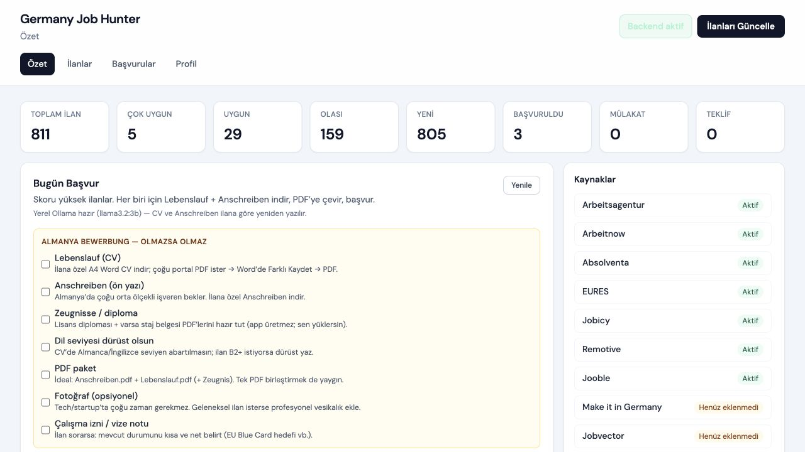
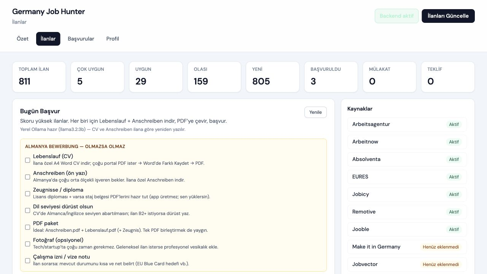
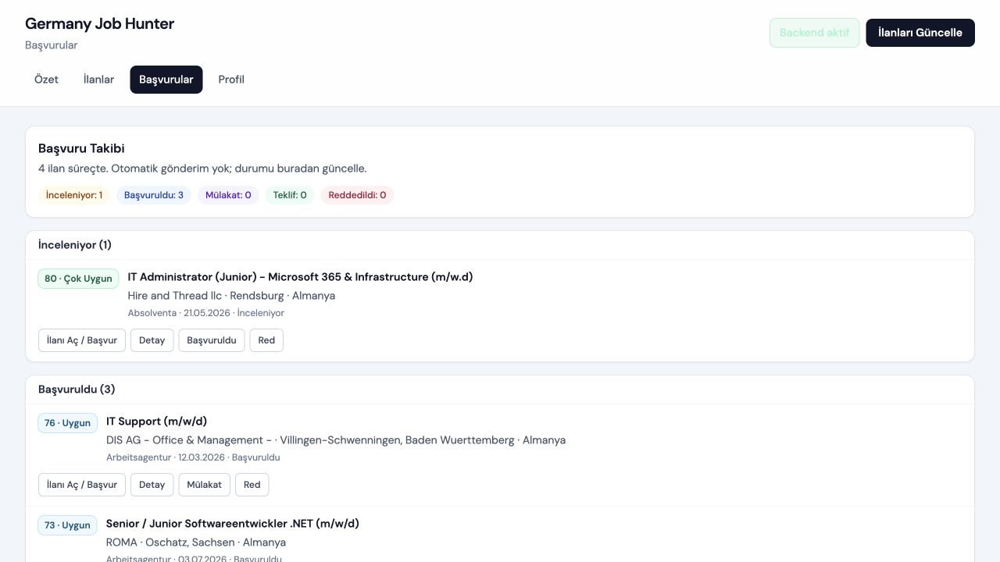

# Almanya Is Bul

Almanya odakli, yerel calisan, Ollama destekli kapsamli is ilani takip ve basvuru hazirlik uygulamasi.

Bu proje Almanya'daki IT, yazilim ve teknik roller icin acik kaynaklardan ilan toplar, ilanlari normalize eder, tekrar kayitlari ayiklar, aday profiline gore uygunluk puani verir ve basvuru surecini tek panelden takip etmeyi kolaylastirir.

Uygulama bulut tabanli bir yapay zeka servisine bagimli degildir. Ollama aciksa CV ozeti, uygunluk maddeleri ve on yazi metinleri yerel model ile uretilir. Ollama kapaliysa sistem calismaya devam eder ve kural tabanli guvenli fallback kullanir.

## Ekran Goruntuleri

### Ozet ve Kaynak Durumu



### Ilan Takibi



### Basvuru Sureci



## One Cikanlar

- Almanya odakli cok kaynakli ilan yenileme
- FastAPI backend ve React + TypeScript frontend
- Yerel SQLite veritabani
- Aday profiline gore uygunluk puanlama
- Ilan normalizasyonu ve tekrar kayit engelleme
- Kaynak bazli durum takibi
- Filtreleme, detay goruntuleme ve basvuru durumu yonetimi
- Ilana ozel A4 Word CV ve on yazi uretimi
- Ollama ile yerel yapay zeka destegi
- Ollama kapaliyken kural tabanli fallback
- Kisisel dosyalari public repoya koymayan gizlilik odakli yapi

## Ollama Destegi

Bu uygulama Ollama'yi repo icine model olarak gommez; kullanicinin kendi bilgisayarinda calisan Ollama servisiyle yerel HTTP API uzerinden konusur. Bu sayede AI destekli metin uretimi bulut servisine zorunlu veri gondermeden yapilabilir.

Ollama acikken uygulama sunlari yapabilir:

- Ilana gore CV ozetini yeniden yazar
- Uygunluk maddelerini daha net hale getirir
- Almanya basvurulari icin on yazi taslagi hazirlar
- Ilan dili ve rol beklentisine gore metni daha profesyonel hale getirir
- Basvuru hazirligini tek ekrandan yonetmeyi kolaylastirir

Ollama kapaliyken uygulama durmaz. Backend yine calisir, ilanlar listelenir, skorlanir ve belge uretimi kural tabanli metinlerle devam eder.

```bash
ollama pull llama3.2:3b
ollama serve
```

`backend/.env` icinde:

```env
OLLAMA_ENABLED=true
OLLAMA_HOST=http://127.0.0.1:11434
OLLAMA_MODEL=llama3.2:3b
```

Yapay zeka destegini kapatmak icin:

```env
OLLAMA_ENABLED=false
```

## Mimari

```text
Ilan Kaynaklari
      |
Kaynak Yoneticisi
      |
Normalize Etme
      |
Rol Siniflandirma
      |
Profil Bazli Puanlama
      |
Tekrar Kayit Kontrolu
      |
SQLite
      |
FastAPI
      |
React Arayuz
      |
Ollama ile Yerel AI Destegi
```

## Ilan Kaynaklari

| Kaynak | Durum | Not |
|---|---|---|
| Arbeitsagentur | Aktif | Public Jobsuche REST API |
| Arbeitnow | Aktif | Public job-board API |
| Absolventa | Aktif | Sitemap + JobPosting JSON-LD |
| EURES | Aktif | Public JSON search API |
| Jobicy | Aktif | Remote/IT ilan akisi |
| Remotive | Aktif | Remote ilan akisi |
| Jooble | API anahtari varsa aktif | `JOOBLE_API_KEY` gerekir |
| Make it in Germany | Hazirlik | Ayrik public API bulunmadigi icin sinirli destek |
| Jobvector | Hazirlik | Partner/Cloudflare korumali |
| GermanTechJobs | Hazirlik | Public API deprecated |
| Glassdoor | Manuel | Manuel link yonlendirme |

Bu proje korumali sayfalari agresif sekilde kazimaz, CAPTCHA asmaya calismaz ve otomatik basvuru yapmaz.

## Kurulum

### Backend

```bash
cd backend
python3 -m venv .venv
source .venv/bin/activate
pip install -r requirements.txt
cp .env.example .env
uvicorn app.main:app --reload --host 127.0.0.1 --port 8000
```

API dokumantasyonu:

```text
http://127.0.0.1:8000/docs
```

### Frontend

Baska bir terminal acin:

```bash
cd frontend
npm install
npm run dev -- --host 127.0.0.1 --port 5173
```

Arayuz:

```text
http://127.0.0.1:5173
```

## Kullanim

1. Backend ve frontend servislerini baslatin.
2. Istege bagli olarak Ollama'yi calistirin.
3. Arayuzde `Ilanlari Guncelle` butonuna basin.
4. Ilanlari skor, kaynak, lokasyon, dil ve calisma modeline gore filtreleyin.
5. Uygun ilanlarda CV ve on yazi uretimini kullanin.
6. Basvuru durumlarini `Yeni`, `Inceleniyor`, `Basvuruldu`, `Mulakat`, `Reddedildi` veya `Teklif` olarak takip edin.

Terminalden ilan yenileme:

```bash
curl -X POST http://127.0.0.1:8000/jobs/refresh
```

Ilk calistirmada veritabani bos olabilir. Ilanlar yenilendikten sonra `backend/data/jobs.db` dosyasi yerel olarak olusur.

## Ortam Degiskenleri

| Degisken | Amac |
|---|---|
| `JOOBLE_API_KEY` | Jooble kaynagini etkinlestirir |
| `JOOBLE_MARKETS` | Varsayilan: `DE` |
| `OLLAMA_ENABLED` | Yerel yapay zeka destegini acar/kapatir |
| `OLLAMA_HOST` | Varsayilan: `http://127.0.0.1:11434` |
| `OLLAMA_MODEL` | Varsayilan: `llama3.2:3b` |
| `ARBEITSAGENTUR_*` | Arbeitsagentur istek limitleri ve zaman asimi ayarlari |
| `ARBEITNOW_*` | Arbeitnow limitleri |
| `ABSOLVENTA_*` | Absolventa limitleri |
| `EURES_*` | EURES limitleri |

## Yerel Dosyalar ve Gizlilik

Public repo kisisel CV, profil, API anahtari veya is ilani veritabani icermemelidir. Bu dosyalar GitHub'a gonderilmez ve `.gitignore` icindedir:

- `backend/.env`
- `backend/data/jobs.db`
- `backend/data/candidate_profile.json`
- `backend/data/cv_profile.json`
- `backend/data/source_*.json`
- `backend/data/private-backup/`

Ollama entegrasyonu yerel kurulum icindir. Model ve prompt islemleri kullanicinin kendi makinesinde calisan Ollama servisine gider.

## Hukuki ve Etik Not

Bu proje bagimsiz, acik kaynakli ve yerel calisan bir yardimci aractir.

- Listelenen is platformlari, kurumlar veya veri saglayicilarla resmi ortaklik iddia etmez.
- Ilan kaynaklarinin kendi kullanim sartlarina uyulmasi kullanicinin sorumlulugundadir.
- Public API veya kullanici tarafindan saglanan API anahtarlari kullanilir.
- Korumali sayfalar, CAPTCHA, Cloudflare veya giris gerektiren icerikler asilmaz.
- Otomatik is basvurusu yapilmaz.
- Ilanlar kullanici tarafindan manuel kontrol edilmeli ve basvurular ilgili resmi ilan sayfasi uzerinden yapilmalidir.

## Proje Yapisi

```text
.
├── README.md
├── PROJECT_SPEC.md
├── TASKS.md
├── docs
│   └── screenshots
├── backend
│   ├── app
│   ├── data
│   ├── tests
│   └── requirements.txt
└── frontend
    └── src
```

## Yol Haritasi

- Tek komutla baslatma script'i
- Demo video
- Daha iyi hata mesajlari
- Kaynak bazli rate-limit ayarlarinin arayuzden yonetimi
- Tauri ile masaustu uygulama paketleme
- Daha kapsamli test dokumantasyonu

## Lisans

Bu proje MIT lisansi ile yayinlanir. Veri kaynaklarinin kullanim sartlari ayrica gecerlidir.
